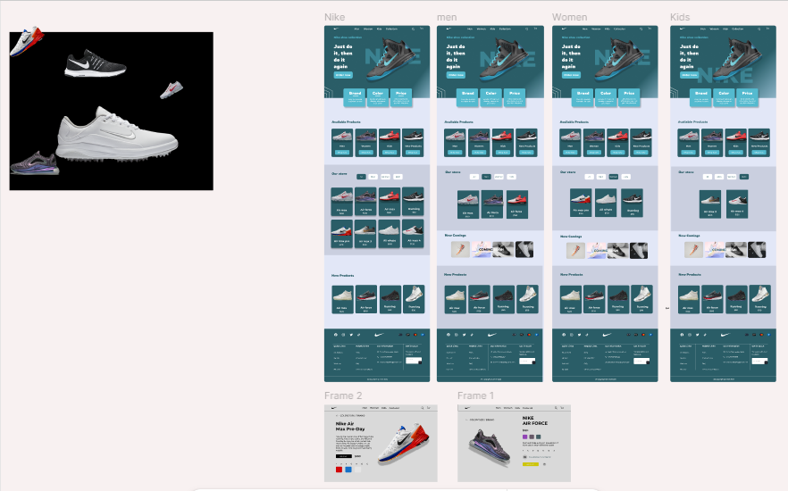

# Nike Website & Landing Page UI/UX Design

A modern and visually engaging **Nike-inspired website and landing page** designed in **Figma**, focused on strong branding, user engagement, and clean visual hierarchy.

## 🎯 Overview
This project showcases a **UI/UX design concept** for Nike’s official website and a promotional **landing page**.  
The goal was to create a minimal, performance-focused interface that highlights Nike’s energy, brand identity, and product storytelling

## 🧠 Design Objectives
- Create a **visually bold layout** using Nike’s signature black, white, and red palette.  
- Maintain **clean typography** and ample white space to enhance focus on products.  
- Deliver a **seamless user journey** from landing page → product highlights → call-to-action.  
- Emphasize **responsive design principles** and accessibility.  

## 🛠️ Tools & Resources
- **Figma** – UI/UX Design and Prototyping  
- **FigJam** – Flowcharts & Brainstorming  
- **Unsplash / Pexels** – High-quality product imagery  
- **Google Fonts (Montserrat, Poppins)** – Typography  

## 💡 Key Features
- Interactive **landing page** showcasing Nike’s latest product line  
- Hero section with bold typography and action-driven CTA  
- Product grid with hover effects and quick-view options  
- Clean **navigation bar** and responsive layout mockup  
- Consistent color scheme maintaining Nike’s brand identity  

## 🧩 Design Process
1. **Research:** Analyzed Nike’s brand tone and website structure.  
2. **Wireframing:** Built low-fidelity layouts focusing on key interactions.  
3. **Prototyping:** Created clickable prototypes in Figma.  
4. **Visual Design:** Applied Nike’s color palette, typography, and imagery.  
5. **User Feedback:** Refined the layout for better clarity and minimalism.

## 📸 Preview Website Page 
 |

⭐ *If you like this design, feel free to star this repository or connect with me for collaborations!*  
